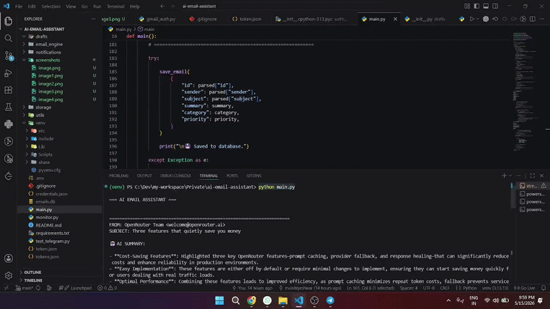
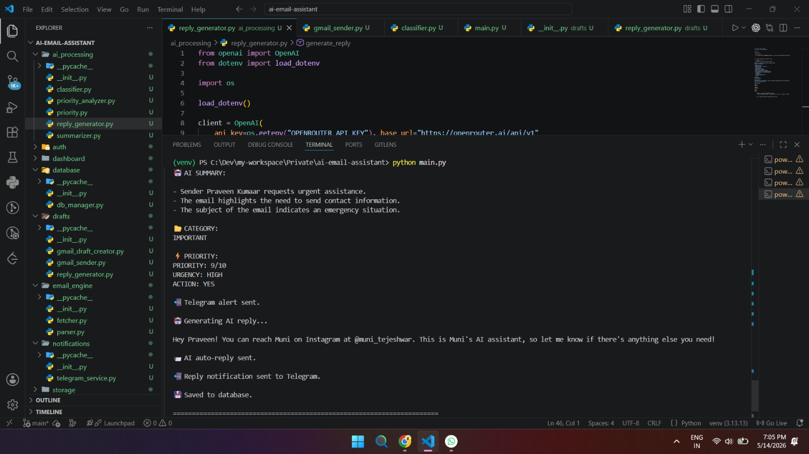
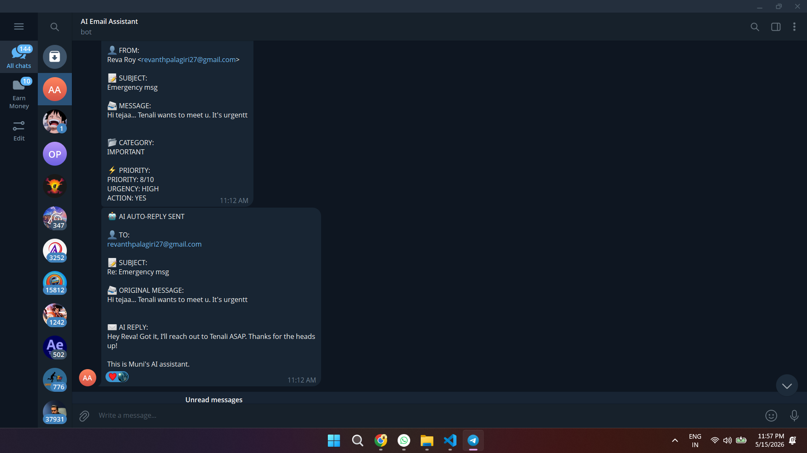
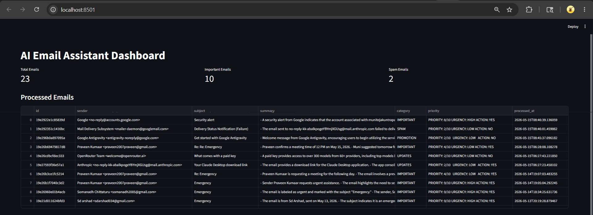

<div align="center">


<br/>

[](https://python.org)
[](https://openrouter.ai)
[](https://streamlit.io)
[](https://developers.google.com/gmail/api)
[](https://core.telegram.org/bots/api)
[](https://sqlite.org)
[](LICENSE)
[]()

<br/>

**An AI-powered email automation system that monitors your Gmail inbox, classifies incoming emails using LLMs, sends real-time Telegram alerts, auto-generates context-aware replies, and surfaces actionable analytics — all from a unified pipeline.**

<br/>

[**View Demo**](#demo) · [**Architecture**](#architecture) · [**Quick Start**](#quick-start) · [**Roadmap**](#roadmap)

<br/>

<div align="center">
---

> 📹 **Demo walkthrough -**



<br/><br/>

| Gmail Monitoring | Telegram Alert | Analytics Dashboard |
|:-:|:-:|:-:|
|  |  |  |

</div>
---

## Overview

AI Email Assistant is an end-to-end email intelligence pipeline built on top of the Gmail API and large language models. It replaces manual inbox triage with an automated system capable of summarizing, classifying, prioritizing, and responding to emails — while pushing structured alerts to Telegram and rendering analytics in a live Streamlit dashboard.

This project demonstrates real-world AI workflow orchestration: OAuth2 authentication, LLM chaining, notification dispatch, persistent storage, and dashboard rendering — wired together into a production-style backend.

---

## Architecture

<div align="center">


</div>

<br/>

```
Gmail Inbox
     │
     ▼
┌─────────────────┐
│  Email Fetcher  │  ← Gmail API v1 (OAuth2)
└────────┬────────┘
         │
         ▼
┌─────────────────┐
│  Email Parser   │  ← Extracts headers, body, metadata
└────────┬────────┘
         │
         ▼
┌────────────────────────────────────────────────────┐
│                AI Processing Layer                  │
│  ┌─────────────┐  ┌─────────────┐                  │
│  │ Summarizer  │  │ Classifier  │                  │
│  └─────────────┘  └─────────────┘                  │
│  ┌──────────────────┐  ┌──────────────────┐        │
│  │ Priority Analyzer│  │  Reply Generator │        │
│  └──────────────────┘  └──────────────────┘        │
└────────────────────────┬───────────────────────────┘
                         │  OpenRouter / GPT Models
                         ▼
              ┌──────────────────┐
              │  SQLite Storage  │
              └──────┬─────┬────┘
                     │     │
           ┌─────────┘     └──────────┐
           ▼                          ▼
  ┌─────────────────┐       ┌──────────────────┐
  │ Telegram Alerts │       │    Streamlit      │
  │   (Bot API)     │       │    Dashboard      │
  └─────────────────┘       └──────────────────┘
```

---

## Features

**Inbox Intelligence**
- Continuous Gmail inbox monitoring via OAuth2-authenticated API polling
- Structured email parsing — sender, subject, thread context, timestamps
- Spam filtering and noise suppression before LLM processing

**AI Processing Layer**
- LLM-powered email summarization (one-line and full-context)
- Multi-label classification: work, personal, financial, promotional, urgent
- Priority scoring with configurable thresholds
- Context-aware auto-reply generation via OpenRouter/GPT models

**Notification & Alerting**
- Real-time Telegram push notifications with structured email summaries
- Priority-gated alerts — only what matters reaches your phone

**Analytics & Storage**
- SQLite-backed persistent email log with metadata
- Streamlit dashboard with filterable views, classification breakdowns, and volume trends
- Draft reply management with review-before-send workflow

---

## Tech Stack

| Layer | Technology | Purpose |
|---|---|---|
| **Language** | Python 3.10+ | Core runtime |
| **Email API** | Gmail API v1 | Inbox access & OAuth2 |
| **LLM Gateway** | OpenRouter API | Multi-model LLM access |
| **AI Models** | GPT-3.5 / GPT-4o | Summarization, classification, replies |
| **Notifications** | Telegram Bot API | Real-time push alerts |
| **Storage** | SQLite | Lightweight persistent store |
| **Dashboard** | Streamlit | Analytics & monitoring UI |
| **Auth** | OAuth2 / Google Credentials | Secure Gmail access |
| **Version Control** | Git / GitHub | Source management |

---

## Project Structure

```
ai-email-assistant/
│
├── ai_processing/          # LLM pipeline — summarizer, classifier, priority, reply gen
├── auth/                   # Gmail OAuth2 flow and token management
├── dashboard/              # Streamlit app — analytics and email viewer
│   └── app.py
├── database/               # SQLite schema, migrations, query helpers
├── drafts/                 # Generated reply drafts (review-before-send)
├── email_engine/           # Gmail API client, inbox poller, thread parser
├── notifications/          # Telegram bot dispatcher
├── storage/                # Data access layer
├── utils/                  # Logging, config, shared helpers
│
├── main.py                 # Single-run processing entrypoint
├── monitor.py              # Continuous inbox monitoring loop
├── requirements.txt
└── README.md
```

---

## Quick Start

### Prerequisites

- Python 3.10+
- Gmail account with API access enabled
- [Google Cloud Console](https://console.cloud.google.com/) project with Gmail API + OAuth2 credentials
- OpenRouter API key
- Telegram bot (create via [@BotFather](https://t.me/botfather))

### Installation

```bash
# 1. Clone the repository
git clone https://github.com/munitejeshwar/ai-email-assistant.git
cd ai-email-assistant

# 2. Create and activate virtual environment
python -m venv venv
source venv/bin/activate        # Windows: venv\Scripts\activate

# 3. Install dependencies
pip install -r requirements.txt
```

### Configuration

```bash
# 4. Copy the environment template and fill in your values
cp .env.example .env
```

```env
# .env
OPENROUTER_API_KEY=your_openrouter_api_key
TELEGRAM_BOT_TOKEN=your_telegram_bot_token
TELEGRAM_CHAT_ID=your_telegram_chat_id
```

```bash
# 5. Add your Gmail OAuth2 credentials
#    Download credentials.json from Google Cloud Console
#    Place it in the auth/ directory
mv ~/Downloads/credentials.json auth/credentials.json
```

### Usage

```bash
# Process inbox once
python main.py

# Run continuous monitoring (recommended)
python monitor.py

# Launch analytics dashboard
streamlit run dashboard/app.py
```

> On first run, a browser window will open for Gmail OAuth2 authorization. A `token.json` will be saved locally for subsequent runs.

---

## Environment Variables

| Variable | Description | Required |
|---|---|---|
| `OPENROUTER_API_KEY` | API key from [openrouter.ai](https://openrouter.ai) | ✅ |
| `TELEGRAM_BOT_TOKEN` | Token from @BotFather | ✅ |
| `TELEGRAM_CHAT_ID` | Your Telegram user or group chat ID | ✅ |

---

## Roadmap

The following capabilities are planned or under active design:

- **Gmail Auto-Labeling** — Apply AI-derived labels directly to inbox threads via the API
- **AI Memory System** — Persist sender context and conversation history across sessions using vector embeddings
- **Live Monitoring Dashboard** — Real-time WebSocket-backed dashboard replacing polling
- **Multi-User Authentication** — Per-user credential isolation and session management
- **Vector Search Memory** — Semantic retrieval over historical email corpus (FAISS / ChromaDB)
- **Cloud Deployment** — Containerized deployment on Railway / Render / GCP with managed secrets
- **Voice Notifications** — Audio summaries via TTS for high-priority alerts
- **Advanced Analytics** — Sender graphs, response time tracking, workload heatmaps

---

## Learning Outcomes

This project covers the following engineering domains:

- **AI Workflow Orchestration** — Chaining multiple LLM calls (summarize → classify → reply) in a structured pipeline
- **OAuth2 Integration** — Implementing the Gmail API auth flow with token refresh
- **API Composition** — Integrating four external APIs (Gmail, OpenRouter, Telegram, Streamlit) into a cohesive system
- **Notification Architecture** — Designing event-driven alert dispatching with priority filtering
- **Backend Engineering** — Building a persistent, modular Python backend with separation of concerns
- **Dashboard Development** — Creating an interactive analytics UI with Streamlit
- **AI Productivity Systems** — Applying LLMs to reduce cognitive overhead in real-world workflows

---

## Contributing

Contributions are welcome. To get started:

```bash
# Fork and clone your fork
git clone https://github.com/your-username/ai-email-assistant.git

# Create a feature branch
git checkout -b feat/your-feature-name

# Commit with a clear message
git commit -m "feat: add vector memory support"

# Push and open a pull request
git push origin feat/your-feature-name
```

Please keep PRs focused — one feature or fix per branch. Open an issue first for significant changes.

---

## License

Distributed under the MIT License. See [`LICENSE`](LICENSE) for details.

---

<div align="center">

Built by [**Muni Tejeshwar**](https://github.com/munitejeshwar)


</div>
